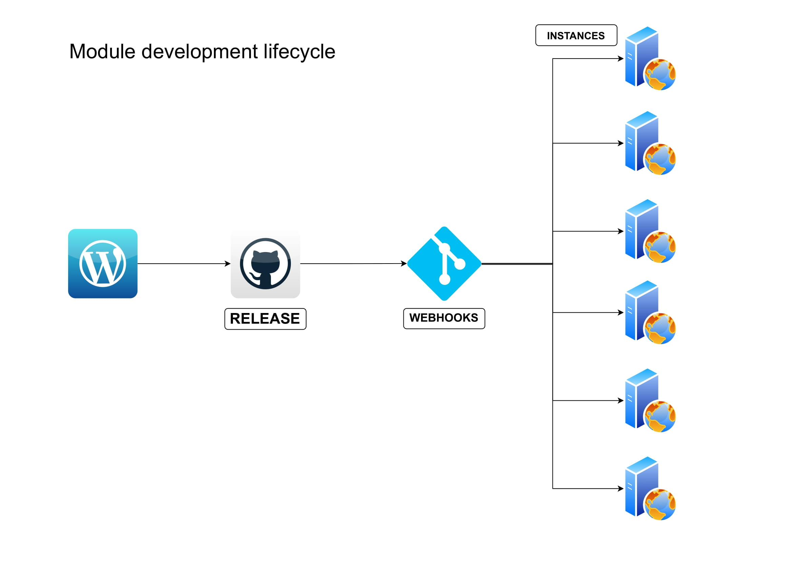

# Autodeploy



Automate Modules development and deploy testing process to N instances with an extremely fast and easy configuration.

## Supported CMS environment

Currently **autodeploy** supports Wordpress and Prestashop environments.

## Installation

Go on your server's CMS root folder and type

```
npx degit buggyzap/autodeploy autodeploy
cd autodeploy
composer install
```

## Configuration

Rename **autodeploy.config.sample.json** to **autodeploy.config.json** and add your

- token: Github Token to authorize git clone/pull operations
- username: Your Github username
- repo: Your Module Github repository name
- filename: Your module .zip filename, eg: mymodule.zip
- module: Your module name, like: mymodule
- security_token: A security token you can create to add an extra layer security between Github and your server instance

## How it works

Assuming that you are using **wp-plugin-helper** or you just have a repository where your module code lives, you need to create a Github release everytime you want to deploy and push changes dynamically to every instances configured.

## Local development side

You need to setup your module to create a .zip file and add it to your Github release.

You can have this flow with using my [NPM TOOL](https://www.npmjs.com/package/wp-plugin-helper) that let you automate Wordpress plugin development, releasing, testing and deploy.

After that you have configured your Github repo with a .zip release and tag you are ready to configure server side.

## Server development side

After installed it on server side ( Installation section ) go to Github and create a new webhook for each instance you want to configure with the autodeploy.

Eg. you have a mywebsite.com and want to use it with autodeploy.

Create a new Github Webhook event that call the url:

https://mywebsite.com/git_hook_update_module.php?security_token=123

for each release event.

Leave other configurations as default and save.

Try to create a new Github release and you got an automatically updated instance (mywebsite.com) module production folder.

## Why you may need it

Imagine the scenario you want to test your module in 20 different instances like

- Multi shop version
- Multi language version
- Multi currency
- Thousands of different product types
- Multiple CMS version and setup

With a single local development environment you will create a new release and test you module on every instance you want.
